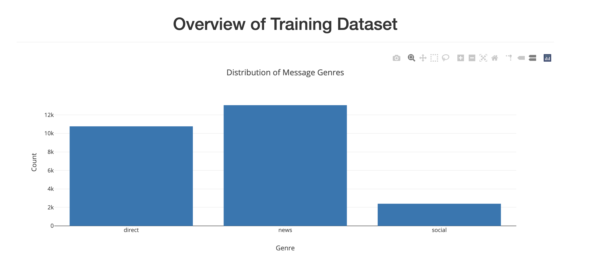
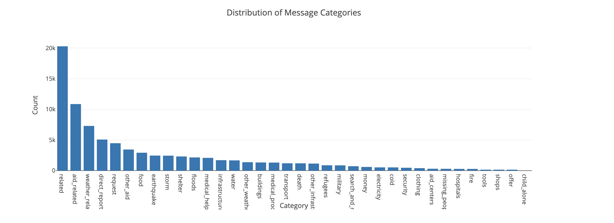
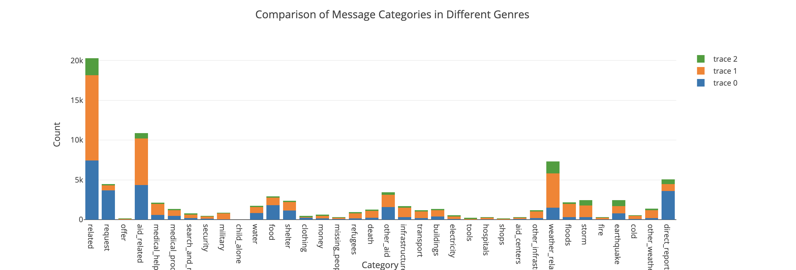

# Disaster Response Pipelines
## Project Overview
This project aims to classify messages sent during disasters into various categories such as aid-related, medical help, search and rescue, etc. This classification can help in directing the messages to appropriate disaster response agencies. The project consists of three main parts: ETL pipeline, Machine Learning pipeline, and a Flask web app.

## Project Motivation
This project was conducted as part of the Udacity Data Scientist Nanodegree program. The datasets utilized were sourced from [Appen](https://www.appen.com/) and include messages and categories data for the disaster data.

## Installations
To run this project, I utilized Visual Studio Code. The following libraries were used:

Python version: 3.9.13
numpy: 1.22.4
pandas: 1.4.4
SQLAlchemy: 1.4.39
nltk: 3.7
scikit-learn: 1.0.2
plotly: 5.9.0

## Instructions
1. **ETL Pipeline:**
    - Run the following command to execute the ETL pipeline that cleans and preprocesses the data:
        ```
        python data/process_data.py data/disaster_messages.csv data/disaster_categories.csv data/DisasterResponse.db
        ```
        
2. **Machine Learning Pipeline:**
    - Run the following command to train the machine learning model:
        ```
        python models/train_classifier.py data/DisasterResponse.db models/model.pkl
        ```

3. **Flask Web App:**
    - Run the following command to start the Flask web app:
        ```
        python app/run.py
        ```
    - Go to http://localhost:3000 in your web browser to access the web app.

## File Descriptions
- `app/`
    - `templates/`
        - `go.html`: HTML template for displaying classification results.
        - `master.html`: HTML template for the main page.
    - `run.py`: Flask web app script.
- `data/`
    - `disaster_categories.csv`: Dataset containing message categories.
    - `disaster_messages.csv`: Dataset containing disaster messages.
    - `process_data.py`: ETL pipeline script.
- `models/`
    - `train_classifier.py`: Machine learning pipeline script.
      
## Licensing, Authors, Acknowledgements
- Credits to [Udacity](https://www.udacity.com/) for providing the project idea and starter code.
- This project is licensed under the MIT License. See the [LICENSE](LICENSE) file for details.

## Screenshots



